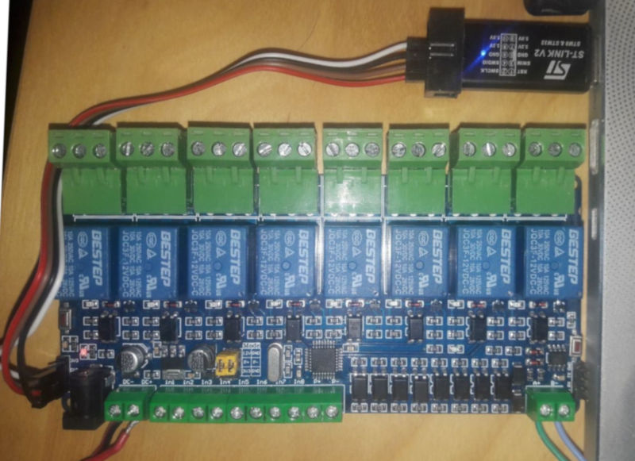
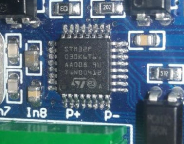

485-relay-8ch
========================

Alternative firmware for an 8-channel RS485 relay board with inputs from aliexpress.

  - Microcontroller : STM32F030K6T6
  - Code : STM32duino

## Build instructions

### STM32duino

Install [STM32duino](https://github.com/stm32duino/Arduino_Core_STM32)

Copy `STM32duino/hardware/stm32/1.9.0/variants/F030RelayBoard`
in `~/.arduino15/packages/STM32/hardware/stm32/1.9.0/variants/`

Edit `~/.arduino15/packages/STM32/hardware/stm32/1.9.0/boards.txt` and add

    # Relay board
    GenF0.menu.pnum.F030RelayBoard=STM32F030 RelayBoard
    GenF0.menu.pnum.F030RelayBoard.upload.maximum_data_size=4096
    GenF0.menu.pnum.F030RelayBoard.upload.maximum_size=32768
    GenF0.menu.pnum.F030RelayBoard.build.board=F030RelayBoard
    GenF0.menu.pnum.F030RelayBoard.build.product_line=STM32F030x6
    GenF0.menu.pnum.F030RelayBoard.build.variant=F030RelayBoard

### modbus-arduino

Install [my modbus-arduino fork](https://github.com/SnouF/modbus-arduino)

### Arduino IDE

open `relaySTM32/relaySTM32.ino`in arduino ide

- select tools -> board type -> Generic STM32F0 series
- select tools -> board part number -> STM32F0 RelayBoard

Build and upload with a ST-Link

## Modbus

### Table

Coil 1-8 relay state (read/write)

### Function support

- Read coils (0x01)
- Write single coil (0x05)
- Write multible coil (0x0f)

